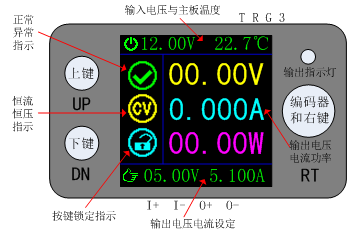
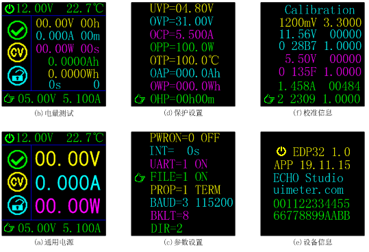
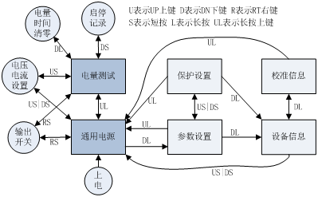

# EDP32 - Digital Programmable Power Supply of ECHO Studio

## 资料汇总

- [EDP32用户手册](DOC/EDP32用户手册v19.11.22.pdf)
- [终端命令行手册](DOC/EDP32_CmdRef.md)
- [MOSBUS协议手册](DOC/EDP32_ModbusRef.md)

## 功能概述

EDP32是一款降压型DCDC电源模块，采用全数字智能控制，支持恒压恒流输出，具备完善的保护功能，
支持电压电流记录功能。产品体积小巧，携带方便，功能强大，可独立使用，也支持嵌入式面板安装，
可替代笨重的桌面型开发调试维修电源，可将普通电源适配器升级为支持恒压恒流定容量定时充电
功能的高级智能充电器。内置的数据记录功能可长时间记录负载电压电流信息，为产品开发提供一手
的数据支持。

## 主要特性

- 小巧便携，支持嵌入式面板安装。
- 1.44寸彩色显示屏，显示方向可任意旋转。
- 宽使用范围：电压30V，电流5.1A。
- 4位电压电流显示，电压10mV分辨率，电流1mA分辨率。
- 完善的保护功能：过压、过流、过温、过功率、超容量、超时、输入反接等。
- 内置库伦计，支持Ah和Wh两种电量显示。
- 简单友好的用户界面，电压电流调整方便。
- 内置8MB存储，支持高达20万条离线数据记录，采样周期可设置。
- 内置先进文件系统，支持磨损均衡技术，最大程度延长闪存寿命。
- 高效串口命令行界面：可以查看设置各种参数。
- 支持工业标准的MODBUS协议，便于用户集成。
- 电压电流全软件校准，提供校准命令。
- 支持固件升级。

## 应用场景

- 硬件研发调试电源。
- 维修电源。
- 通用电池充电器。
- 直流电压信号发生器。
- 直流电流信号发生器。
